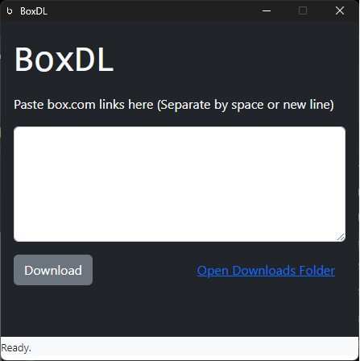

# Box.com Downloader - Electron Version

This application can scrape and download protected docx, pdf files in box.com and save it as an editable PDF file.

### Installation
#### Windows
1. Go to the [Releases](https://github.com/aebibtech/boxdl_desktop/releases) section of this repo.
2. Download the one with the Setup.exe in the name.

#### Debian/Ubuntu
Coming soon...

#### macOS
Coming soon...

### Usage
1. Run the app.
2. Paste your box.com links.
3. Press Download. Downloaded files go to the Downloads folder.

### Development

Want to contribute? Great!
Make a change in your file and instantanously see your updates!

### Todos
 - Write Tests
 - Change download directory
 - Parallel Downloads
 - Table View for Links
 - Checkout the source code to know more

### Did you find this useful?

License
----
GNU General Public License v3.0
